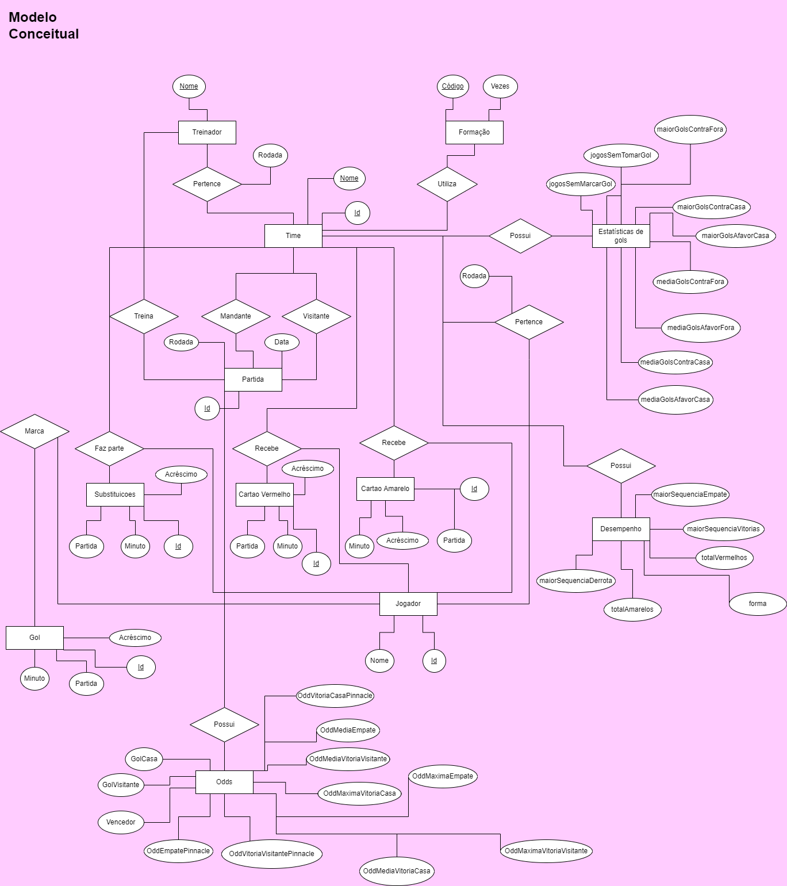
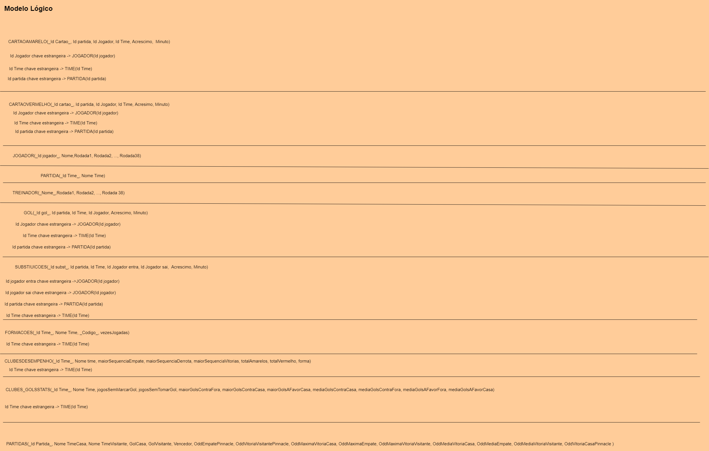
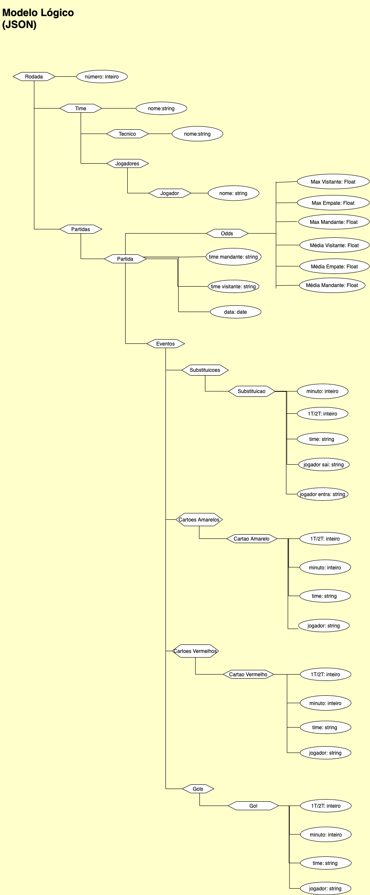
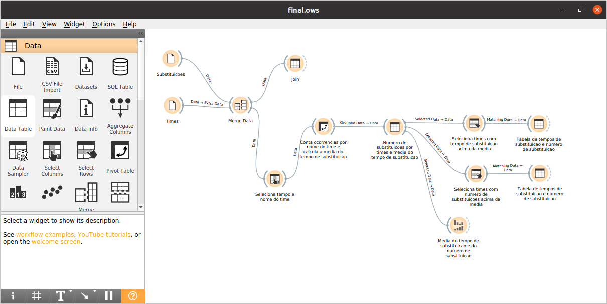

# Modelo para Apresentação da Entrega Final do Projeto

# Projeto `Aposta Certa`

# Equipe `AGoldenDatabase` - `GOLDB`
* `Alan Freitas Ribeiro` - `193400`
* `David Afonso Borges dos Santos` - `261032`
* `Gabriel Dourado Seabra` - `216213`

## Resumo do Projeto
 Ultimamente tem se tornado muito comum a análise de eventos esportivos orientada a dados, especialmente para realizar previsões e apostas de curto e longo prazo sobre os resultados de um campeonato. No entanto, muitos sites de estatística ainda carecem de informações que podem ser relevantes para o entendimento dos resultados do campeonato. Nesse sentido, buscamos compilar e formatar dados diversos sobre os times e partidas no Brasileirão em um banco de dados que permita traçar correlações entre as condições dos times e seus resultados.

Nossa base de dados, além de guardar informações sobre as partidas (como data, times visitante/madante, vencedor, gols do time visitante, gols do time mandante), também trará informações sobre cada integrante do elenco, como numero de substituições, gols marcados, cartões amarelos e vermelhos. Integramos também, a nossa base de dados a aos Odds de pré-jogo de sites de apostas online. Espera-se que, com estes dados, possamos ententar quais fatores mais corroboram para os resultados de um time no campeonato.

## Slides da Apresentação
[Slides](assets/Aposta%20certa.pdf)

## Modelo Conceitual

## Modelos Lógicos

Modelo Relacional

 Modelo Hierarquico
 

## Dataset Publicado
> Elencar os arquivos/bases preliminares dos datasets serão publicados.

título do arquivo/base | link | breve descrição
----- | ----- | -----
Cartaoa | [Cartões Amarelos](data/processed/cartaoa.csv) | Tabela contendo os cartões amarelos das 380 partidas
Cartaov | [Cartões Vermelhos](data/processed/cartaov.csv) | Tabela contendo os cartões vermelhos das 380 partidas
Desempenho | [Desempenho](data/processed/desempenho.csv) | Tabela contendo o desempenho dos 20 times do campeonato
Formacoes | [Formacoes](data/processed/formacoes.csv) | Tabela contendo as formações usadas pelos times durante o campeonato
Gol | [Gol](data/processed/gol.csv) | Tabela contendo todos os gols marcados durante as 380 partidas do campeonato
GolStats | [Estatisticas de Gol](data/processed/golStats.csv) | Tabela contendo estatisticas sobre os gols para os 20 times
Jogadores | [Jogadores](data/processed/jogadores.csv) | Tabela contendo as partidas jogadas por todos os jogadores do campeonato
Partidas | [Partidas](data/processed/partidas.csv) | Tabela com o resumo e as odds de cada partida
Rounds | [Rounds](data/processed/rounds.json) | JSON no formato especificado pelo respectivo modelo
Subst | [Substituições](data/processed/subst.csv) | Tabela com as substituições feitas em todas as partidas
Tecnicos | [Tecnicos](data/processed/tecnicos.csv) | Tabela com todos os tecnicos do campeonato e suas partidas disputadas
Times | [Times](data/processed/times.csv) | Tabela com o id de cada time que disputou o campeonato

## Bases de Dados
título da base | link | breve descrição
----- | ----- | -----
`API-Football` | [link para a página da base](https://api-football.com) | API com diversas informações sobre os times e partidas disputadas do campeonato brasileiro 2019
`Football Data Betting Odds` | [link para a página da base](https://www.football-data.co.uk/brazil.php) | Resultados das probabilidades de apostas de encerramento (casa-empate-visitante) da Pinnacle Sports, bem como os odds máximos e média dentre uma série de casas de apostas. Dados do campeonato brasileiro de 2012 a 2021

## Detalhamento do Projeto

 Para extrair os dados relevantes da API de partidas de futebol, usamos o módulo requests do Python para fazer as chamadas à API. O código usado foi compartilhado em um notebook do Google Colab e os objetos JSON extraídos foram salvos automaticamente no Google Drive. Inicialmente, tivemos que obter uma lista de todas as partidas do Campeonato Brasileiro de 2019. O objeto JSON retornado pela requisição foi salvo em um arquivo "fixtures.json", que contém uma lista de todas as partidas (fixtures) e um identificador único para cada partida. 

Com esses identificadores, pudemos fazer novas requisições sobre informações de cada partida (fixtures/events e fixtures/lineups). Dessas requisições, criamos dois dicionários (um para os eventos e outro para os lineups) com 380 entradas cada, em que cada entrada tem como chave o ID da partida da API.

~~~python
# para cada partida
if str(id_partida) not in events_dict.keys():
  # requisitar e salvar eventos da partida em fixtures-events.json
  events_response = requests.request("GET", events_url, headers=headers, params=querystring)
  new_events_data = events_response.json()
  events_dict[str(id_partida)] = new_events_data['response']
~~~

Esses dicionários foram então salvos em dois arquivos (fixtures-events.json e fixtures-lineups.json) para serem lidos posteriormente.

~~~python
with open(path_to_fixtures_events, 'w') as f:
    json.dump(events_dict, f)
    f.close()
~~~

Com os três arquivos JSON em mãos (fixtures.json, fixtures-events.json e fixtures-lineups.json), com 380 entradas cada, pudemos lê-los afim de criar as seguintes tabelas:

- Partidas: partidas.csv
- Jogadores: jogadores.csv
- Treinadores(Técnicos): treinadores.csv
- Cartões Amarelos: cartaoa.csv
- Cartões Vermelhos: cartaov.csv
- Times: times.csv
- Gols: gols.csv
- Substutuições: subst.csv

Exemplo de trecho de código que extrai de fixtures-events.json dados para construir a tabela de todos os cartões amarelos:

~~~python
for jogo in data.keys():
  partida = data[str(jogo)]
  for evento in partida: 
    if evento["type"] == 'Card' and evento["detail"] == "Yellow Card":
      cartaoa.append(
        [id_evento,jogo,evento["team"]["id"],evento["player"]["id"],evento["time"]["elapsed"],evento["time"]["extra"]]
      )
      id_evento += 1
~~~

Para extrair os dados relevantes da tabela de Odds importamos o arquivo csv providenciado no "football-data.co.uk" usando Pandas. Dele pudemos extrair os odds máximos assim como a média de odds calculada por uma série de diferentes casas de apostas. Para isso, tivemos que primeiramente encontrar, partindo apenas dos nomes dos times mandante e visitante, o ID da partida conforme as tabelas construídas anteriormente. Fizemos isso através da construção de um dicionário de partidas em que cada chave relaciona um conjunto de dois times (uma string "Mantante X Visitante") ao seu respectivo ID:

~~~python
for index, row in odds.iterrows():
    times_key = str(row['Home']).upper() + " X "+ str(row['Away']).upper()
    odds.at[index, 'PartidaID'] = partidas[times_key]
~~~

Com o csv de Odds pudemos juntas ambos os dados na construção da tabela "partidas.csv", que contém o resumo da partida e os odds de pré-jogo. Vale frisar também que o csv bruto importado do site apresentava nomes dos times escritos de forma diferente, tivemos que tratar manualmente padronizando o formato dos nomes dos times.

## Evolução do Projeto
Inicialmente tivemos muita dificuldade de obter bases de dados confiáveis e convenientes. Passamos por muitas dificuldades após perceber que as bases sugeridas nas entregas anteriores eram inviáveis de serem extraídas usando web scraping ou pdf scraping (com pdf de dados da CBF). Após muito tempo encontramos uma API com tudo que precisamos e um site com bases de dados de apostas que poderíamos usar. Como nosso modelo já estava pronto, foi razoavelmente simples adaptar as novas bases ao nosso projeto inicial. Tivemos algumas dificuldades menores ao longo do desenvolvimento também, tais como as descritas anteriormente para tratar o csv de Odds com o csv de partidas, em que tivemos que manualmente alterar os nomes para o formato padronizado e pesquisar as partidas por string ("mandante X visitante").

## Perguntas de Pesquisa/Análise Combinadas e Respectivas Análises

### Perguntas/Análise com Resposta Implementada

#### Pergunta/Análise 1
* Qual a relação entre substituições e o desempenho de um time no campeonato?
  
  * Foi decidido que para essa análise utilizariamos o Orange. Primeiramente, então carregamos as tabelas de substituições e de times na ferramenta e realizamos o join, depois selecionamos apenas as colunas com nome e tempo do time. A partir daí contamos as ocorrências de substituições e agrupamos por time e calculamos a média do tempo de substituição. Depois visualizamos a média geral de tempo de substituição e de número de substituição. Em um primeiro momento selecionamos apenas os times com tempo de substituição acima da média e foi possível verificar a presença de times bem posicionados no campeonato, como o campeão, por exempo. Já em um segundo momento, diante dos times com número de substituições acima da média foi possível perceber a presença de um grande número de times com desempenho fraco, dentre eles vários que seriam rebaixados para a segunda divisão no próximo ano. A conclusão, portanto é que times com bom desempenho geralmente precisam realizar poucas substituições.
  * [Link para o workflow](https://github.com/AGoldenDatabase/TrabalhoFinal/tree/main/final/src)

#### Pergunta/Análise 2
* Pergunta 2: Defesas mais sólidas tem impacto nas vitórias fora de casa?
  * Utilizamos o sqlite3 para fazer essa analise, onde, por meio das tabelas de Partidas e Estatisticas de Gols tentamos obter uma resposta. Para isso, criamos duas views, uma com as estatisticas de partidas sem sofrer gols por cada time e com jogos sem marcar gols, além dessa, criamos uma outra view, que pegava os resultados com apenas vitórias fora de casa. Daí, ordenamos estas duas views por ordem decrescente, a primeira, por partidas sem sofrer gols e a segunda, pela quantidade de vitorias fora de casa. Analisando o resultado, temos que existe um impacto em ter uma defesa mais sólida nas vitorias fora de casa, onde os times que menos tomaram gols no campeonato foram em sua maioria, os que mais figuraram dentre as primeiras posições de vitorias fora de casa.

#### Pergunta/Análise 3: 
* Se fizermos apostas sempre de acordo com os Odds médios, a chance de acerto?
    
  Etapas realizadas
  * Da tabela de partidas, selecionar todas as colunas com AvgA > AvgH e Res = H
  * Da tabela de partidas, selecionar todas as colunas com AvgH > AvgA e Res = A
  * Dar join em ambas as seleções
  * Contar quantas linhas
* Resultado: concluímos que com essa estratégia, há cerca de 53% de acerto usando esse método, o que é uma acurácia melhor que os 33% da chance aleatória.

### Perguntas/Análise Propostas mas Não Implementadas

#### Pergunta/Análise 1
> * Jogadores que marcam muitos gols são escalados em mais partidas?
>   
>   * Podemos agrupar os registros da tabela de gols pelo nome dos jogadores e contar suas ocorrencias, a partir daí, podemos contar a media de gols de cada jogador e comparar os resultados. Esta analise tem relevancia para definir as apostas antes do inicio da partida, de modo que poderemos analisar e tentar prever as escalações de alguns jogadores e dar um palpite no numero de gols que a partida poderá ter.

#### Pergunta/Análise 2
> * Jogadores que receberam cartões em partidas são frequentemente substituidos?
>   
>   * Podemos realizar essa analise, selecionando uma view da tabela de cartões amarelos com o time mandante, time visitante e nome do jogador. Após isso, podemos selecionar na tabela de substituições os casos em que temos as partidas com o mesmo time mandante, time visitante e nome de jogadores que façam parte da seleção anterior. Daí, contamos o numero de registros e fazemos a mesma operação, só que agora para os jogadores que não levaram cartão. Esta analise pode ser util, pois existem apostas sobre o jogador que vai dar assistencia ou marcar um gol, com isso, podemos analisar se vale a pena ou não apostar em jogadores que costumam levar um maior numero de cartões para este tipo de aposta.

#### Pergunta/Análise 3
> * Marcar gols no inicio da partida geralmente resultam em vitoria?
>   
>   * Podemos agrupar os registros da tabela de gols por um tempo minimo, e ver quais times marcam mais dentro deste tempo. Daí, basta verificarmos na tabela de partidas se esses times ganharam o jogo. Esta é uma analise muito util, pois poderemos ter uma ideia se vale a pena apostar em um time que costuma marcar mais cedo em sua partida que o time adversario em questão.

> Links das queries:
> [Pergunta 2](notebooks/analiseAtaqueDefesa.ipynb)
> [Pergunta 3](notebooks/analisePerguntaOdds.ipynb)
