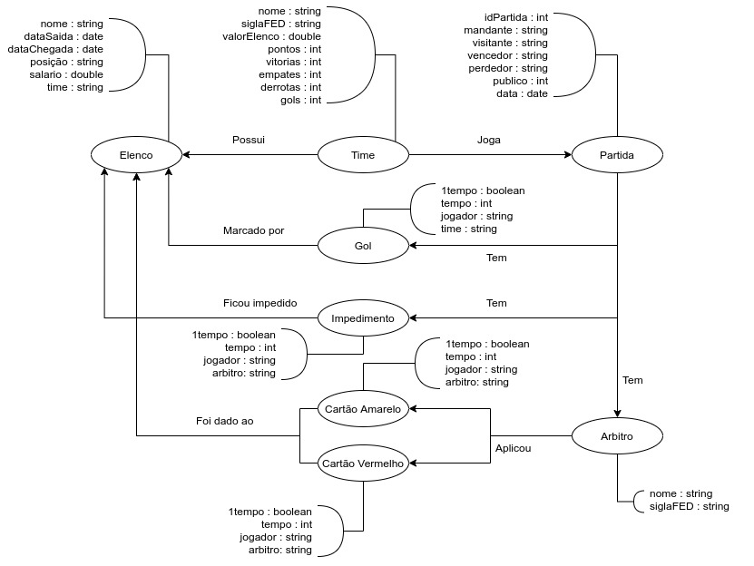

# Equipe `<AGoldenDatabase>` - `<GOLDB>`
* `<Alan Freitas Ribeiro>` - `<193400>`
* `<David Afonso Borges dos Santos>` - `<261032>`
* `<Gabriel Dourado Seabra>` - `<216213>`

## Modelo Lógico Combinado do Banco de Dados de Grafos
>
> 

## Perguntas de Pesquisa/Análise Combinadas e Respectivas Análises

> Liste aqui as perguntas de pesquisa/análise combinadas e revisadas dos membros da equipe e respectivas análises.
>
### Pergunta/Análise 1
> * O valor do elenco/investimento de cada clube tem grande impacto em sua posição na competição?
>   
>   * Podemos usar alguma técnica de centralidade para analisar esta pergunta, a medida em que analisamos o fluxo de eventos da partida aos jogadores respectivos de cada time, analisando assim, se os jogadores que tem maior fluxo de eventos, como gols e participações são jogadores com maior valor de mercado.

### Pergunta/Análise 2
> * Partidas jogadas como mandante (Em seu estádio) tem influência no resultado da partida?
>   
>   * Podemos usar a técnica de vulnerabilidade para fazer esta analise, de modo que, podemos medir o impacto das partidas como mandante, comparando a porcentagem de efetividade do time total durante o campeonato e depois, remover os nós com partidas como mandante, e analisar o novo valor de porcentagem de vitorias.

### Pergunta/Análise 3
> * Qual postura tem maior impacto nas partidas disputadas? (E.g. Defesas mais sólidas vs Melhores ataques)
>   
>   * Podemos utilizar os Motifs para fazer a analise desta pergunta, de modo que, podemos correlacionar a maior presença de padrões a um determinado sistema tático, por exemplo, times com uma postura defensiva marcam mais faltas e tendem a tomar menos gols, e ao marcarem gols, geralmente vencem a partida, tornando-se um sistema mais efetivo nesta competição do que as outras posturas adotadas.
