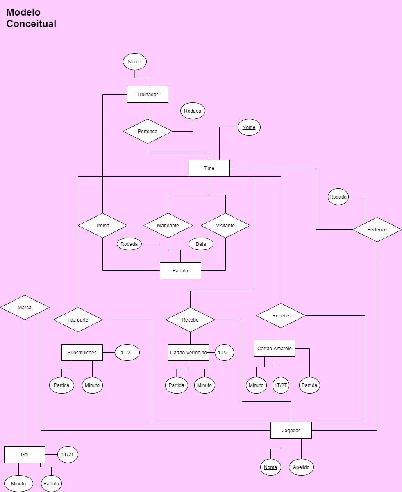
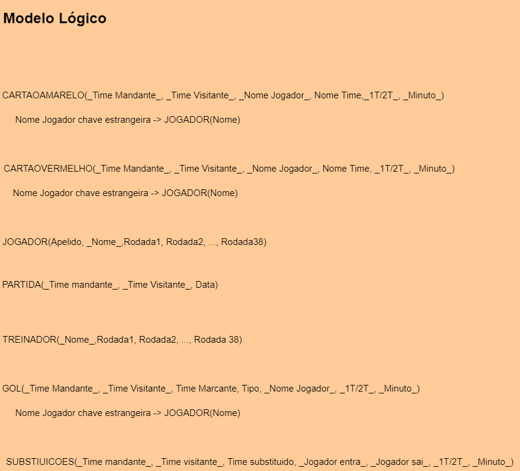
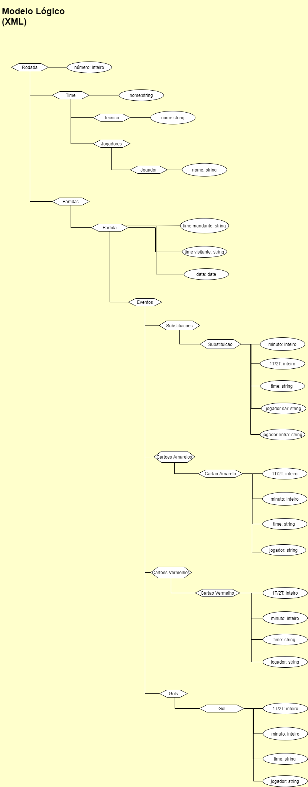

# Modelo para Apresentação da Entrega Prévia do Projeto

# Projeto `<Dataset público sobre times e partidas do Campeonato Brasileiro de Futebol>`

# Equipe `<AGoldenDatabase>` - `<GOLDB>`
* `<Alan Freitas Ribeiro>` - `<193400>`
* `<David Afonso Borges dos Santos>` - `<261030>`
* `<Gabriel Dourado Seabra>` - `<216213>`

## Resumo do Projeto
> Ultimamente tem se tornado muito comum a análise de eventos esportivos orientada a dados, especialmente para realizar previsões e apostas de curto e longo prazo sobre os resultados de um campeonato. No entanto, muitos sites de estatística ainda carecem de informações que podem ser relevantes para o entendimento dos resultados do campeonato. Nesse sentido, buscamos compilar e formatar dados diversos sobre os times e partidas no Brasileirão em um banco de dados que permita traçar correlações entre as condições dos times e seus resultados.

> Nossa base de dados, além de guardar informações sobre as partidas (como data, times visitante/madante, vencedor, gols do time visitante, gols do time mandante), também trará informações sobre  cada integrante do elenco, como numero de substituições, gols marcados, cartões amarelos e vermelhos. Espera-se que, com estes dados, possamos ententar quais fatores mais corroboram para os resultados de um time no campeonato.

## Slides da Apresentação
> Coloque aqui o link para o PDF da apresentação prévia

## Modelo Conceitual Preliminar

> Coloque aqui a imagem do modelo conceitual preliminar em ER ou UML, como o exemplo a seguir:
> 
> 

## Modelos Lógicos Preliminares

> Coloque aqui os primeiros modelos lógicos dos bancos de dados relacionados aos modelos conceituais.
> 
> 

> Modelo JSON:
> 
> 

## Bases de Dados
> Elencar as bases de dados fonte utilizadas no projeto.

título da base | link | breve descrição
----- | ----- | -----
`<CBF>` | [Tabela 2019](https://www.cbf.com.br/futebol-brasileiro/competicoes/campeonato-brasileiro-serie-a/2019) | `<Contem todos os jogos disputados no campeonato brasileiro serie A de 2019, onde cada partida, possui uma sumula contendo informações sobre os eventos ocorridos na mesma.>`
`<Google>` | [Tabela de Jogos](https://www.google.com/search?q=tabela+brasileir%C3%A3o+2019&oq=tabela&aqs=chrome.0.69i59j69i57j35i39j0i67i131i433l2j69i61l3.1206j0j4&sourceid=chrome&ie=UTF-8#sie=lg;/g/11fhwkn08h;2;/m/0fnk7q;mt;fp;1;;) | `<Contem informações de quase todas as partidas disputadas durante o ano de 2019, com anotação de eventos minuto a minuto.>` 
`<Wikipedia>` | [Brasileirão Serie A 2019](https://pt.wikipedia.org/wiki/Campeonato_Brasileiro_de_Futebol_de_2019_-_S%C3%A9rie_A) | `<Contem informações uteis, como as mudanças de tecnico por rodada, resumo geral de confrontos, etc.>`
